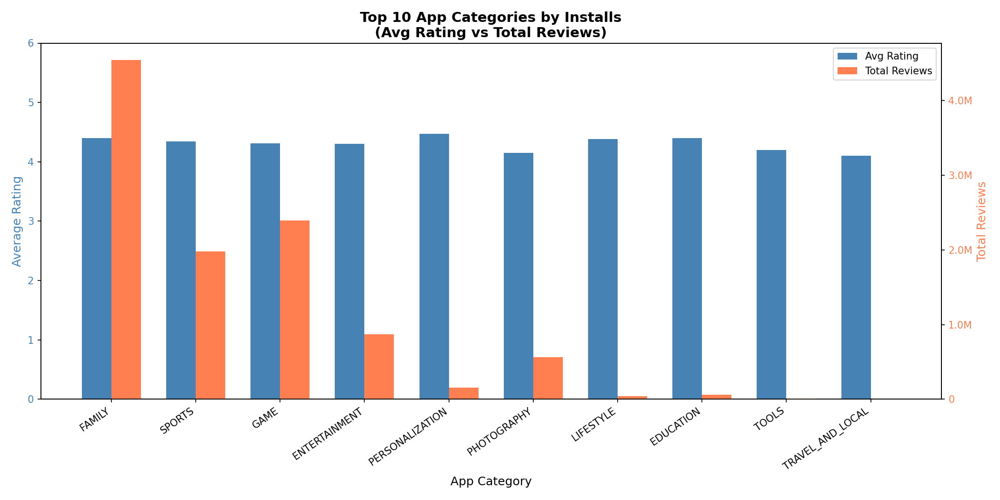

## Google Play Store - Data Analysis
### Task: Top 10 App Categories by Installs
- Tool: Python (Matplotlib, Pandas)
- Filters: Rating ≥ 4.0, Size ≥ 10MB, Last Updated in January
- Chart: Grouped bar chart - Avg Rating vs Total Reviews

