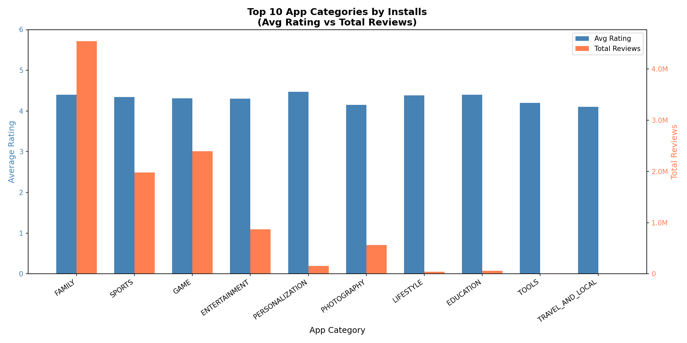
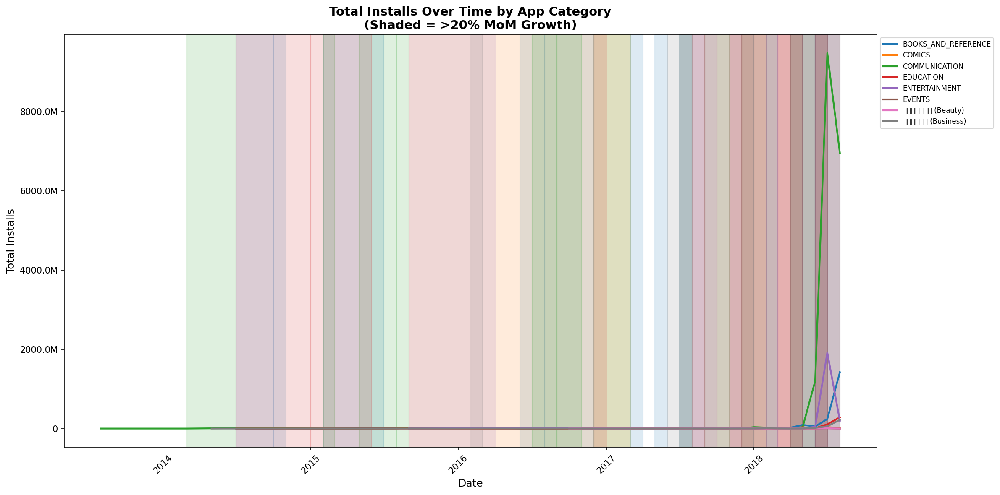

## Google Play Store - Data Analysis

### Task 1: Grouped Bar Chart
- Tool: Python (Matplotlib, Pandas)
- Top 10 app categories by installs
- Filters: Rating ≥ 4.0, Size ≥ 10MB, Last Updated in January
- Time restricted: 3 PM – 5 PM IST only

### Task 2: Interactive Choropleth Map
- Tool: Python (Plotly)
- Top 5 app categories by installs
- Filters: Installs > 1M, Excluding categories starting with A, C, G, S
- Time restricted: 6 PM – 8 PM IST only

### Task 4: Time Series Line Chart
- Tool: Python (Matplotlib)
- Total installs over time segmented by category
- Shaded areas where MoM growth > 20%
- Filters: Category starts with E/C/B, Reviews > 500, App name excludes S and X/Y/Z start
- Translations: Beauty→Hindi, Business→Tamil, Dating→German
- Time restricted: 6 PM – 9 PM IST only

