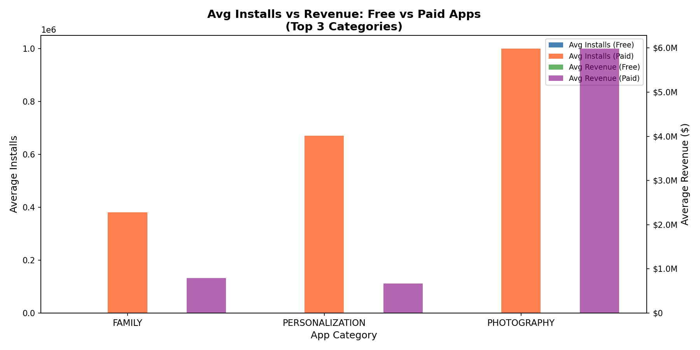
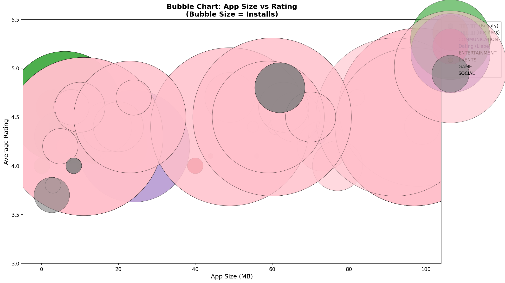
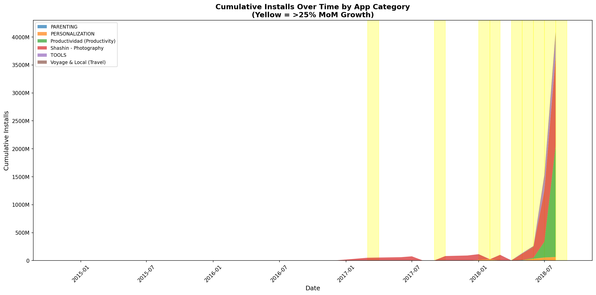

## Google Play Store - Data Analysis

### Task 1: Grouped Bar Chart
- Tool: Python (Matplotlib, Pandas)
- Top 10 app categories by installs
- Filters: Rating ≥ 4.0, Size ≥ 10MB, Last Updated in January
- Time restricted: 3 PM – 5 PM IST only

### Task 2: Interactive Choropleth Map
- Tool: Python (Plotly)
- Top 5 app categories by installs
- Filters: Installs > 1M, Excluding categories starting with A, C, G, S
- Time restricted: 6 PM – 8 PM IST only

### Task 3: Dual-Axis Chart
- Tool: Python (Matplotlib)
- Avg Installs vs Revenue for Free vs Paid apps
- Top 3 categories: FAMILY, PERSONALIZATION, PHOTOGRAPHY
- Filters: Installs ≥ 10K, Revenue ≥ $10K, Android > 4.0, Size > 15MB
- Content Rating = Everyone, App name ≤ 30 characters
- Time restricted: 1 PM – 2 PM IST only

### Task 4: Time Series Line Chart
- Tool: Python (Matplotlib)
- Total installs over time segmented by category
- Shaded areas where MoM growth > 20%
- Filters: Category starts with E/C/B, Reviews > 500, App name excludes S and X/Y/Z start
- Translations: Beauty→Hindi, Business→Tamil, Dating→German
- Time restricted: 6 PM – 9 PM IST only

### Task 5: Bubble Chart
- Tool: Python (Matplotlib)
- App Size vs Average Rating, Bubble Size = Installs
- Filters: Rating > 3.5, Reviews > 500, Installs > 50K, Subjectivity > 0.5
- App name excludes letter S
- GAME category highlighted in Pink
- Translations: Beauty→Hindi, Business→Tamil, Dating→German
- Time restricted: 5 PM – 7 PM IST only

### Task 6: Stacked Area Chart
- Tool: Python (Matplotlib)
- Cumulative installs over time by app category
- Filters: Rating ≥ 4.2, No numbers in app name, Category starts with T/P, Reviews > 1000, Size 20-80MB
- Translations: Travel & Local→French, Productivity→Spanish, Photography→Japanese
- Yellow shading highlights >25% MoM growth periods
- Time restricted: 4 PM – 6 PM IST only

